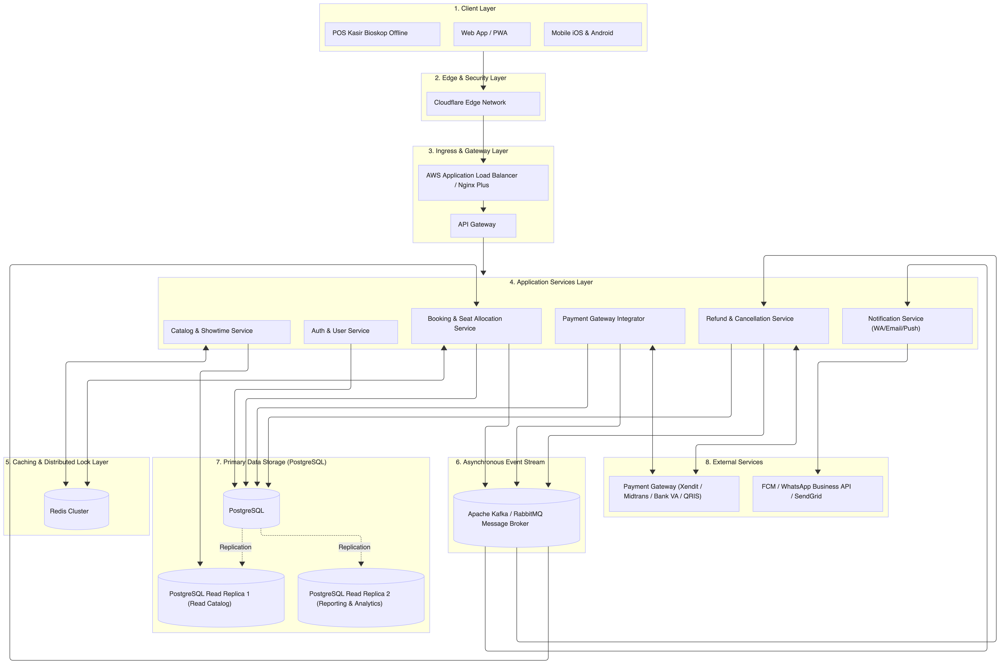
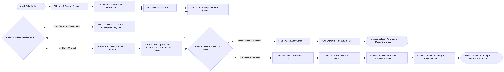

# Backend Development Test - PT Mitra Kasih Perkasa (MKP) 2025
## Online Cinema Ticketing Platform (National Scale)

Repositori ini memuat implementasi dan solusi teknis komprehensif untuk **Backend Development Test - APPS2PAY 2025 PT Mitra Kasih Perkasa (MKP)**.

---

## 📌 Identitas Kandidat
- **Nama Lengkap**: Dito Aditya Nugroho
- **Posisi**: Backend Developer
- **Repository GitHub**: [https://github.com/Dito-7/MKP-Backend-Dev-Test](https://github.com/Dito-7/MKP-Backend-Dev-Test)
- **Tech Stack**: Golang 1.26, PostgreSQL 14+, Redis, Docker & Docker Compose, JWT, Postman

---

## 📑 Daftar Isi
1. [Bagian A: System Design Test](#bagian-a-system-design-test)
   - [1. Topologi Sistem Skala Nasional](#1-topologi-sistem-skala-nasional)
   - [2. Flowchart Alur Sistem](#2-flowchart-alur-sistem)
   - [3. Penjelasan Solusi Teknis](#3-penjelasan-solusi-teknis)
2. [Bagian B: Database Design Test](#bagian-b-database-design-test)
   - [1. Entity Relationship Diagram (ERD)](#1-entity-relationship-diagram-erd)
   - [2. Skrip PostgreSQL Siap Pakai](#2-skrip-postgresql-siap-pakai)
3. [Bagian C: Skill Test (Backend Golang)](#bagian-c-skill-test-backend-golang)
   - [1. Arsitektur Kode (Clean Architecture)](#1-arsitektur-kode-clean-architecture)
   - [2. Endpoint API & Fitur](#2-endpoint-api--fitur)
4. [Panduan Menjalankan Aplikasi](#panduan-menjalankan-aplikasi)
   - [Opsi 1: Menggunakan Docker Compose (Direkomendasikan)](#opsi-1-menggunakan-docker-compose-direkomendasikan)
   - [Opsi 2: Menjalankan Secara Lokal (Native Go)](#opsi-2-menjalankan-secara-lokal-native-go)
5. [Pengujian API Menggunakan Apidog](#pengujian-api-menggunakan-apidog)

---

## Bagian A: System Design Test

### 1. Topologi Sistem Skala Nasional
Topologi dirancang berbasis cloud microservices berketahanan tinggi (*High Availability*) untuk melayani puluhan cabang bioskop di berbagai kota di Indonesia.



> File desain topologi visual resolusi tinggi tersimpan di [`docs/architecture/system_topology.png`](docs/architecture/system_topology.png)

**Komponen Utama:**
- **Edge Layer**: Cloudflare (CDN caching katalog, WAF, proteksi anti-DDoS bot scalper).
- **Ingress & Gateway**: AWS Application Load Balancer (Rate Limiting per-IP, filter JWT Bearer).
- **Application Services**: Cluster Golang stateless diorkestrasi via Kubernetes.
- **Caching & Locking**: Redis Cluster v7 (Distributed Lock / Redlock untuk *atomic seat reservation* & TTL 10 menit).
- **Asynchronous Bus**: Apache Kafka / RabbitMQ (Event-driven decoupling untuk refund, notifikasi, dan seat release).
- **Database Layer**: PostgreSQL (Write, ACID transaction) & Read Replicas (Read katalog jadwal).

---

### 2. Flowchart Alur Sistem
Alur transaksi pembelian tiket bioskop yang intuitif dan mudah dipahami:



> File diagram flowchart resolusi tinggi tersimpan di [`docs/architecture/system_flowchart.png`](docs/architecture/system_flowchart.png).

---

### 3. Penjelasan Solusi Teknis

#### a. Sistem Pemilihan Kursi (Anti Race Condition & Zero Double-Booking)
- **Layer 1 (In-Memory Atomic Lock via Redis)**:
  Saat penonton memilih kursi `A1` pada jadwal `SCHED-100`, backend mengeksekusi:
  ```text
  SET lock:schedule:SCHED-100:seat:A1 user_id_123 NX EX 600
  ```
  Operasi bersifat *atomic sub-millisecond*. Jika ada 1.000 user menekan kursi yang sama, hanya 1 request pertama yang berhasil mendapatkan nilai `OK`. 999 request lainnya langsung mendapat respons `409 Conflict` tanpa membebani database utama.
- **Layer 2 (Database Transaction Level Lock)**:
  Saat user checkout, query PostgreSQL dieksekusi dengan `SELECT ... FOR UPDATE` dalam satu transaksi ACID untuk memvalidasi dan mengubah status kursi menjadi `RESERVED` dengan `locked_until = NOW() + INTERVAL '10 minutes'`.

#### b. Sistem Restok Tiket Bioskop Otomatis (Auto-Restock / Release Seat)
- **Redis TTL Keyspace Notification**: Ketika waktu tunggu 10 menit habis dan user belum menyelesaikan pembayaran, event `expired` dipancarkan oleh Redis.
- **Worker Compensation**: Golang Background Worker menangkap event ini, membatalkan transaksi (`status = 'EXPIRED'`), dan mengembalikan status kursi menjadi `AVAILABLE`.
- **Safety Net Cron Job**: Dijalankan setiap 1 menit untuk membersihkan kursi berstatus `RESERVED` yang telah melampaui `locked_until`.

#### c. Alur Refund & Pembatalan dari Pihak Bioskop
- **Trigger Pembatalan**: Admin/Manajer Bioskop mengubah jadwal menjadi `CANCELLED`.
- **Pencegahan Transaksi Baru**: Seluruh kursi pada jadwal tersebut ditutup secara instan.
- **Idempotent Batch Refund**: Sistem mencari semua transaksi `PAID` pada jadwal tersebut, men-generate *Refund Code* unik (mencegah duplikasi transfer), dan mem-publish event ke Message Queue.
- **Automated Disbursement**: Worker mengeksekusi API refund ke Payment Gateway (E-Wallet/Bank/QRIS) secara asinkron.
- **Notifikasi & Audit Log**: Pembeli menerima notifikasi otomatis via WhatsApp dan Email berisi permohonan maaf dan bukti transfer pengembalian dana 100%.

---

## Bagian B: Database Design Test

### 1. Entity Relationship Diagram (ERD)
Skema database ternormalisasi (3NF).


**Daftar Tabel Utama:**
1. `users`: Akun pengguna dan otorisasi (`ADMIN`, `STAFF`, `CUSTOMER`).
2. `cities` & `cinemas`: Cabang bioskop skala nasional.
3. `studios` & `seats`: Studio auditorium (Regular, IMAX, Premiere) beserta peta denah kursi.
4. `movies`: Katalog master data film.
5. `schedules`: Jadwal penayangan film dengan validasi anti-bentrok waktu di studio yang sama.
6. `schedule_seats`: Status kursi dinamis per sesi jadwal (`AVAILABLE`, `RESERVED`, `BOOKED`).
7. `bookings` & `booking_seats`: Riwayat transaksi tiket penonton.
8. `payments`: Pembayaran (QRIS, VA, E-Wallet) dan status lunas/kedaluwarsa.
9. `refunds`: Rekonsiliasi pengembalian dana akibat pembatalan jadwal oleh bioskop.
10. `audit_logs`: Pencatatan jejak audit sistem.

### 2. Skrip PostgreSQL Siap Pakai
Tim penilai MKP dapat menguji dan mengimport skrip SQL langsung dari direktori:
- **DDL Skema Migrasi**: [`database/migrations/000001_init_schema.up.sql`](database/migrations/000001_init_schema.up.sql)
- **Rollback Skrip**: [`database/migrations/000001_init_schema.down.sql`](database/migrations/000001_init_schema.down.sql)
- **Dummy Seed Data Siap Uji**: [`database/seeds/000001_seed_data.sql`](database/seeds/000001_seed_data.sql)

> **Akun Default untuk Pengujian (Password: `password123`):**
- **Admin**: `admin@mkp.com`
- **Staff**: `staff@mkp.com`
- **Customer**: `customer@mkp.com`

---

## Bagian C: Skill Test (Backend Golang)

### 1. Arsitektur Kode (Clean Architecture)
Aplikasi dikembangkan menggunakan bahasa pemrograman **Golang** dengan struktur direktori *Clean Architecture*:
```text
MKP-Backend-Dev-Test/
├── cmd/
│   └── api/
│       └── main.go                 # Entry point aplikasi
├── internal/
│   ├── config/                     # Konfigurasi environment
│   ├── entity/                     # Domain model & DTOs
│   ├── repository/                 # Data access layer (PostgreSQL)
│   ├── usecase/                    # Business logic layer
│   └── delivery/
│       └── http/
│           ├── handler/            # HTTP Handlers (Auth & Schedules)
│           ├── middleware/         # JWT Auth, CORS, Logger
│           └── router.go           # Definisi route API
├── pkg/
│   ├── database/                   # PostgreSQL connection pool
│   ├── hash/                       # Bcrypt hashing & validation
│   ├── jwt/                        # JWT token generation & verification
│   └── response/                   # Format respons JSON standar
├── database/
│   ├── migrations/                 # DDL skema PostgreSQL
│   └── seeds/                      # Data awal (Users, Films, Bioskop)
├── docs/                           # Dokumentasi arsitektur, ERD, dan diagram
├── docker-compose.yml              # Deployment stack (Postgres + App)
├── Dockerfile                      # Multi-stage container image
├── Makefile                        # CLI shortcuts (run, test, docker-up)
└── README.md
```

### 2. Endpoint API & Fitur

| HTTP Method | Path | Deskripsi | Auth Required |
|:---|:---|:---|:---:|
| `GET` | `/health` | Health check server | ❌ Tidak |
| `POST` | `/api/login` | Login user & generate JWT Token | ❌ Tidak |
| `POST` | `/api/logout` | Mengakhiri sesi client dengan token Bearer valid | ✅ Ya (Bearer Token) |
| `POST` | `/api/register` | Registrasi user baru | ❌ Tidak |
| `GET` | `/api/profile` | Ambil data profil user yang login | ✅ Ya (Bearer Token) |
| `POST` | `/api/schedules` | Tambah jadwal tayang (cek anti-bentrok) | ✅ Ya (Bearer Token) |
| `GET` | `/api/schedules` | Ambil daftar jadwal (filter & pagination) | ✅ Ya (Bearer Token) |
| `GET` | `/api/schedules/:id` | Ambil detail jadwal tayang | ✅ Ya (Bearer Token) |
| `PUT` | `/api/schedules/:id` | Update data/waktu/harga jadwal tayang | ✅ Ya (Bearer Token) |
| `DELETE`| `/api/schedules/:id` | Hapus jadwal tayang | ✅ Ya (Bearer Token) |

---

## Panduan Menjalankan Aplikasi

### Opsi 1: Menggunakan Docker Compose (Direkomendasikan)
Cara termudah untuk menguji aplikasi dan database PostgreSQL sekaligus tanpa instalasi manual:

```bash
# 1. Jalankan container PostgreSQL dan Backend API
docker compose up --build

# Aplikasi langsung aktif di http://localhost:8080
# Database PostgreSQL beserta schema dan seed data otomatis terisi!
```

Untuk menghentikan:
```bash
docker compose down -v
```

---

### Opsi 2: Menjalankan Secara Lokal (Native Go)

**Prasyarat:**
- Golang (versi 1.20+)
- PostgreSQL 14+ aktif di localhost:5432

**Langkah-langkah:**
```bash
# 1. Buat database di PostgreSQL
psql -U postgres -c "CREATE DATABASE mkp_cinema;"

# 2. Jalankan skema database dan seed data
psql -U postgres -d mkp_cinema -f database/migrations/000001_init_schema.up.sql
psql -U postgres -d mkp_cinema -f database/seeds/000001_seed_data.sql

# 3. Salin file konfigurasi environment
cp .env.example .env
# Sesuaikan kredensial DB_USER dan DB_PASSWORD pada file .env jika diperlukan

# 4. Jalankan unit test
go test -v ./...

# 5. Jalankan aplikasi
go run cmd/api/main.go
```

Server akan aktif dan siap menerima request di `http://localhost:8080`.

---

## Pengujian API Menggunakan Apidog

Dokumentasi API tersedia di:
🔗 [Apidog API Documentation](https://u2tfr6lnvo.apidog.io)

Akses project Apidog:
🔗 [Join MKP Backend Dev Test Project](https://app.apidog.com/invite/project?token=y7rxCv4QyIK_DbvYPYI1E)

### Cara Pengujian:
1. Buka [dokumentasi API Apidog](https://u2tfr6lnvo.apidog.io).
2. Gunakan link undangan project untuk bergabung ke project Apidog jika diperlukan.
3. Jalankan endpoint `POST /api/login` menggunakan akun default pada bagian database.
4. Salin JWT token dari response login ke authorization Bearer pada request berikutnya.
5. Uji endpoint profile, CRUD schedules, debug conflict, kondisi error, dan logout sesuai dokumentasi.

Base URL aplikasi lokal:
```text
http://localhost:8080
```
